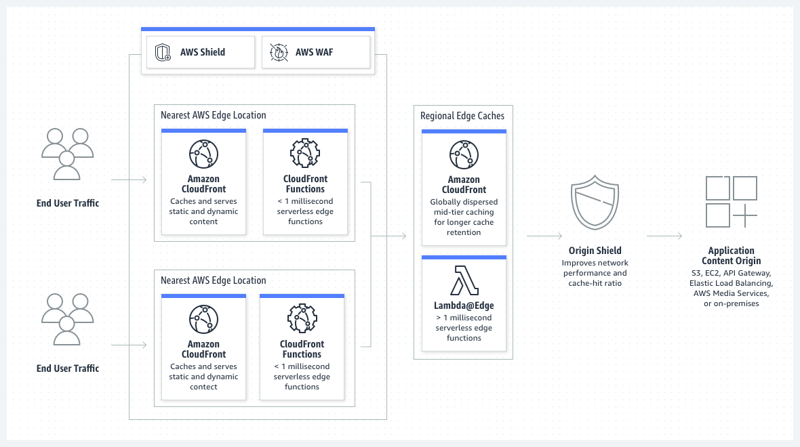

## Cloud services

The term "cloud services" refers to a wide range of services delivered on-demand to companies and customers over the internet. These services are designed to provide easy, affordable access to applications and resources, without the need for internal infrastructure or hardware. Types of cloud services solutions are - SaaS, PaaS, and IaaS.  
Pros:
- Unlimited storage capacity
- Automated backup/restore of files and data
- Fewer administrative or management hassles
- Improved collaboration and mobility

Cons:
- Dependent upon an internet connection at all times
- Files are easy to store but not as simple to recover and download
- Cloud management can be complicated to monitor
- Data loss or theft and data leakage

### Bare Metal Server vs Cloud Service
The bare metal server is traditionally known as a [dedicated server](https://www.globo.tech/dedicated-server-hosting) or a physical server. It’s installed within a datacenter in a controlled and highly monitored environment.
The server dedicates all it’s hardware resources (CPU, RAM, Storage, Network port) to a single tenant, you. You keep a dedicated access to all ressources and you don’t have to deal with performance variations and degradation.

**Pros**
- Full hardware performances
- High level of security – Single tenant
- Lower storage cost

**Cons**

- Higher price
- Customizable
- Not auto-scalable

# AWS
## Zone & Region
AWS has the concept of a Region, which is a physical location around the world where we cluster data centers. We call each group of logical data centers an Availability Zone. Each AWS Region consists of multiple, isolated, and physically separate AZs within a geographic area. Unlike other cloud providers, who often define a region as a single data center, the multiple AZ design of every AWS Region offers advantages for customers. Each AZ has independent power, cooling, and physical security and is connected via redundant, ultra-low-latency networks. AWS customers focused on high availability can design their applications to run in multiple AZs to achieve even greater fault-tolerance. AWS infrastructure Regions meet the highest levels of security, compliance, and data protection.
 
 
An Availability Zone (AZ) is one or more discrete data centers with redundant power, networking, and connectivity in an AWS Region. AZs give customers the ability to operate production applications and databases that are more highly available, fault tolerant, and scalable than would be possible from a single data center. All AZs in an AWS Region are interconnected with high-bandwidth, low-latency networking, over fully redundant, dedicated metro fiber providing high-throughput, low-latency networking between AZs. All traffic between AZs is encrypted. The network performance is sufficient to accomplish synchronous replication between AZs. AZs make partitioning applications for high availability easy. If an application is partitioned across AZs, companies are better isolated and protected from issues such as power outages, lightning strikes, tornadoes, earthquakes, and more. AZs are physically separated by a meaningful distance, many kilometers, from any other AZ, although all are within 100 km (60 miles) of each other.

## IAM Best Practices
- Use roles to delegate permissions
- Grant least privilege
- Never use root credentials.
- Use groups for IAM policies
- Use MFA for better security
- Use strong passwords
- Remove outdated IAM credentials

## EC2
Amazon Elastic Compute Cloud (Amazon EC2) offers the broadest and deepest compute platform, with over 500 instances and choice of the latest processor, storage, networking, operating system, and purchase model to help you best match the needs of your workload. We are the first major cloud provider that supports Intel, AMD, and Arm processors, the only cloud with on-demand EC2 Mac instances, and the only cloud with 400 Gbps Ethernet networking. We offer the best price performance for machine learning training, as well as the lowest cost per inference instances in the clo. More SAP, high performance computing (HPC), ML, and Windows workloads run on AWS than any other cloud.

Use cases:
- Run cloud-native and enterprise applications
- Scale for HPC applications
- Train and deploy ML applications

## VPC
Amazon Virtual Private Cloud (Amazon VPC) gives you full control over your virtual networking environment, including resource placement, connectivity, and security. Get started by setting up your VPC in the AWS service console. Next, add resources to it such as Amazon Elastic Compute Cloud (EC2) and Amazon Relational Database Service (RDS) instances. Finally, define how your VPCs communicate with each other across accounts, Availability Zones, or AWS Regions. In the example below, network traffic is being shared between two VPCs within each Region.

Use cases:
- Launch a simple website or blog
- Host multi-tier web applications
- Create hybrid connections

## Cloud Storage
AWS storage services:
- Amazon Simple Storage Service (S3)
- Amazon Elastic File System
- Amazon FSX
- Amazon Elastic Block Store

## Route 53
Amazon Route 53 is a highly available and scalable cloud DNS web service. It is designed to give developers and businesses an extremely reliable and cost effective way to route end users to Internet applications by translating names like www.example.com into the numeric IP addresses like 192.0.2.1 that computers use to connect to each other. Amazon Route 53 is fully compliant with IPv6 as well.

Amazon Route 53 effectively connects user requests to infrastructure running in AWS – such as Amazon EC2 instances, Elastic Load Balancing load balancers, or Amazon S3 buckets – and can also be used to route users to infrastructure outside of AWS. You can use Amazon Route 53 to configure DNS health checks, then continuously monitor your applications’ ability to recover from failures.

## CloudFront

Amazon CloudFront is a content delivery network (CDN) service built for high performance, security, and developer convenience.

## CloudWatch
Amazon CloudWatch is a monitoring and observability service built for DevOps engineers, developers, site reliability engineers (SREs), IT managers, and product owners. CloudWatch provides you with data and actionable insights to monitor your applications, respond to system-wide performance changes, and optimize resource utilization. CloudWatch collects monitoring and operational data in the form of logs, metrics, and events. You get a unified view of operational health and gain complete visibility of your AWS resources, applications, and services running on AWS and on-premises. You can use CloudWatch to detect anomalous behavior in your environments, set alarms, visualize logs and metrics side by side, take automated actions, troubleshoot issues, and discover insights to keep your applications running smoothly.

# Links
Mandatory task:
- EC2 with nginx/apache: 3.86.163.34
- EC2 without nginx/apache: 54.165.153.190

Optional task:
- EC2 with nginx/apache: 3.89.220.159
- EC2 without nginx/apache: 3.216.91.29
- S3 Bucket screenshot like: https://myawsbucket268.s3.amazonaws.com/Screenshot+from+2022-06-20+12-16-24.png
